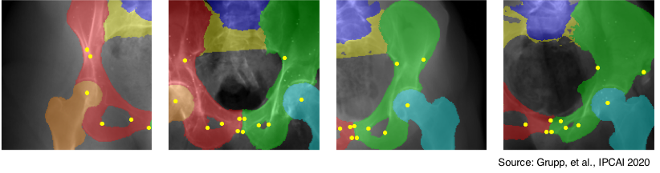
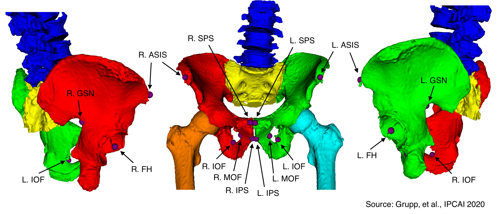

# DeepFluoroLabeling-IPCAI2020


This repository contains implementation details for automatically annotating fluoroscopy of the hip.
Higher-level information, including clinical motivations, prior works, algorithmic details, applications to 2D/3D registration, and experimental details, may be found in the IPCAI 2020 paper "Automatic Annotation of Hip Anatomy in Fluoroscopy for Robust and Efficient 2D/3D Registration," available at https://arxiv.org/abs/1911.07042 or https://doi.org/10.1007/s11548-020-02162-7.
The primary contents of this repository are:
- Links to the annotated dataset of *actual* hip fluoroscopy used for training/testing,
- Documentation and examples for using the dataset,
- Python code for training and testing the proposed models.

The dataset consists of CT, fluoroscopy, and derived data from six lower torso cadaveric specimens.

Implementations of the registration algorithms, both *offline* and *online*, are provided in the [Regi2D3D-IPCAI2020](https://github.com/rg2/Regi2D3D-IPCAI2020) repository.

For any questions or feature requests, please open an issue or send an email to Rob (grupp@jhu.edu).

We hope that this code and data will be useful in the development of new computer-assisted capabilities that leverage fluoroscopy.
If you have used the code or dataset, we kindly ask that you cite our paper:
```
Grupp, Robert B., et al. "Automatic annotation of hip anatomy in fluoroscopy for robust and efficient 2D/3D registration." International Journal of Computer Assisted Radiology and Surgery (2020): 1-11.
----------------------------------------------------------------------
@article{grupp2020automatic,
  title={Automatic annotation of hip anatomy in fluoroscopy for robust and efficient {2D}/{3D} registration},
  author={Grupp, Robert B and Unberath, Mathias and Gao, Cong and Hegeman, Rachel A and Murphy, Ryan J and Alexander, Clayton P and Otake, Yoshito and McArthur, Benjamin A and Armand, Mehran and Taylor, Russell H},
  journal={International Journal of Computer Assisted Radiology and Surgery},
  pages={1--11},
  publisher={Springer}
}
```

## Annotations

Segmentation labels are assigned to the following skeletal structures:
- Left Hemipelvis (`1`)
- Right Hemipelvis (`2`)
- Vertebrae (`3`)
- Upper Sacrum (`4`)
- Left Femur (`5`)
- Right Femur (`6`)

All other pixels should be assigned to background (`0`).
Label values are consistent across 2D and 3D segmentations (e.g. the left femur is labeled `5` in both the 3D segmentation and 2D segmentation).
We did not attempt to model the lower sacrum, since it is a difficult shape to characterize in 3D and 2D and does not aid our intended applications.

The following bilateral anatomical landmarks are considered:
- ASIS: Anterior Superior Iliac Spine
- FH: Femoral Head Center
- GSN: Greater Sciatic Notch
- IOF: Interior Obturator Foramen
- MOF: Medial Obturator Foramen
- SPS: Superior Pubis Symphysis
- IPS: Inferior Pubis Symphysis

Since each landmark is bilateral, a "-l" is appended to the name to indicate left and a "-r" is appended to the name to indicate right.
For example, "FH-r" is the right femoral head center.

The 3D landmarks and bone structures are shown below:


## Datasets

**_You can access the annotated dataset in full-resolution [here](http://tiny.cc/ipcai_2020_full_res_data) in HDF5 format (2.5 GB)._**
However, this data was preprocessed prior to training and testing of the models.
Several preprocessed versions of the dataset, ready for training/testing are also available in HDF5 format:
- [2x Downsampled](http://tiny.cc/ipcai_2020_ds_2x) (659 MB)
- [4x Downsampled](http://tiny.cc/ipcai_2020_ds_4x) (165 MB)
- [8x Downsampled](http://tiny.cc/ipcai_2020_ds_8x) (42 MB) (*This was used in the IPCAI paper*)
- [16x Downsampled](http://tiny.cc/ipcai_2020_ds_16x) (11 MB)

Documentation on the organization of data within each HDF5 is found [here](hdf5_layouts/Readme.md).
Some example code for using these files is provided in [examples_dataset](examples_dataset).
Examples of using the preprocessed datasets for training/testing are in [train_test_code](train_test_code).

The specimen numbers (1-6) from the paper map to the following specimen IDs in the full dataset files:
- `1 --> 17-1882`
- `2 --> 18-1109`
- `3 --> 18-0725`
- `4 --> 18-2799`
- `5 --> 18-2800`
- `6 --> 17-1905`

The preprocessing steps consist of cropping 50 pixels from each border to remove collimater effects, log transforming the projection data, rotation to ensure patient is "up," and downsampling. 

Log transforming uses the Beer-Lambert law to approximately convert pixels from measured X-ray intensities to line integrals of attenuation units.
Intuitively, this maps "bone is dark" to "bone is bright."

Some of the projections need to be rotated 180 degrees to have the patients oriented "up," which places the superior aspect of the hip at the top of the image and the inferior aspect of the hip at the bottom of the image.
The need for this rotation is automatically determined from metadata present in the DICOM files produced by the C-arm.

The downsampling factors indicate the amount of downsampling in each 2D dimension.
Experiments in the IPCAI paper used 8x downsampling.
Although the intensity projections are directly downsampled in 2D, the 2D segmentations are downsampled by ray-casting against a smaller detector grid.
Directly downsampling the full-resolution 2D segmentations should also work and may yield smoother ground truth labelings.

Original files for the CT scans and 2D fluoroscopy files are part of the dataset from our [TBME paper](https://arxiv.org/abs/1903.09339), *which will be made available soon*.

## Training/Testing Code

Python code for training and testing the models is found in [train_test_code](train_test_code).
The [Readme](train_test_code/Readme.md) also provides details on the Python environment and example commands for training/testing and examining the data.

## Applications to 2D/3D Registration

In the IPCAI 2020 companion paper, we use these annotations to perform automatic registrations of the pelvis and each femur.
The following YouTube video shows several examples: https://youtu.be/5AwGlNkcp9o.
Implementations of these registration strategies are provided in the [Regi2D3D-IPCAI2020](https://github.com/rg2/Regi2D3D-IPCAI2020) repository

## Licensing

The datasets are provided under a [CC BY-NC 4.0](http://creativecommons.org/licenses/by-nc/4.0/) license (Attribution and Noncommercial).
The Python code in this repository is provided under a [GPLv3](https://www.gnu.org/licenses/gpl-3.0.html) license.
