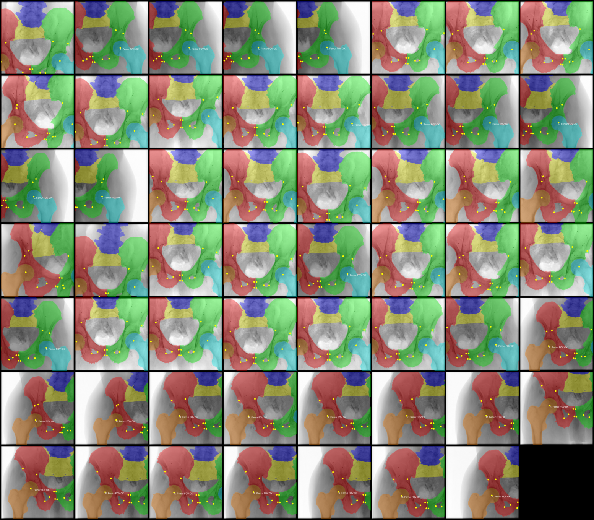
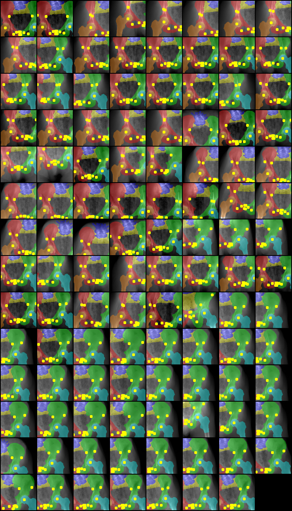
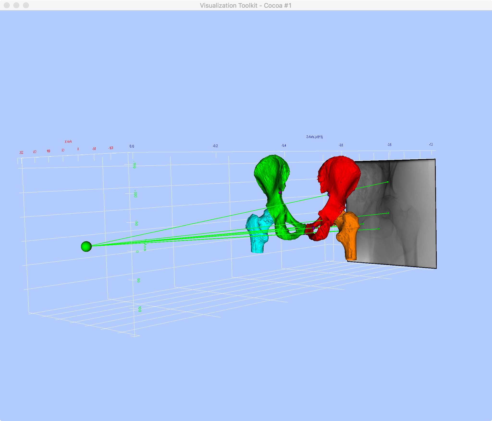
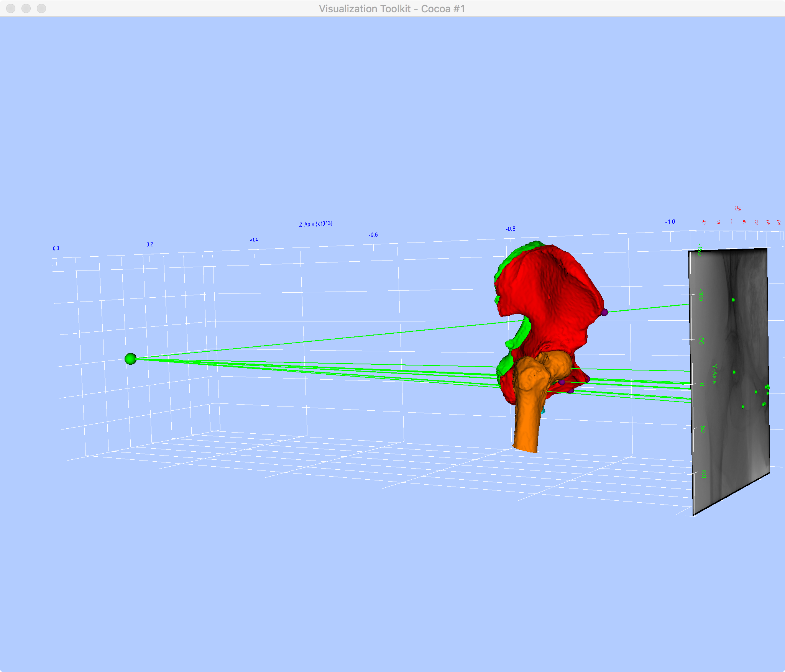
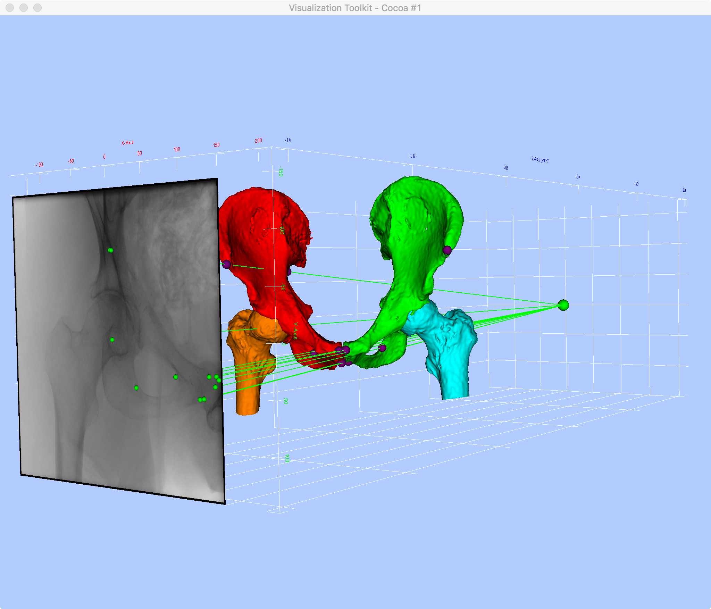

# Examples Scripts for Accessing the Datasets

This directory contains some scripts that demonstrate how to access information in the datasets.
For examples of using the dataset for training/testing models, see the [train_test_code](../train_test_code) directory.

## make_full_res_overlays.py

This script reads the 2D projections, 2D ground truth segmentations, and 2D ground truth landmark locations from the *full-resolution* dataset and writes out color images with the segmentations and landmarks overlaid on the projections.
A single PNG file, containing a tiled display of each overlay, is created for each specimen.

Example usage:
```
python make_full_res_overlays.py ipcai_2020_full_res_data.h5
```

This will create the following files in the current working directory:
- `17-1882.png`
- `17-1905.png`
- `18-0725.png`
- `18-1109.png`
- `18-2799.png`
- `18-2800.png`

`18-2800.png` should look something like this:


## make_preproc_overlays.py

This script creates overlays nearly identical to those of `make_full_res_overlays.py`, but for the pre-processed datasets.

Example usage:
```
python ipcai_2020_ds_16x.h5
```

This will create the following overlay files in the current working directory:
- `01.png`
- `02.png`
- `03.png`
- `04.png`
- `05.png`
- `06.png`

`01.png` should look similar to:


Note that the intensities are inverted compared to the full-resolution overlay (bone is now bright).

## full_res_3d_viz.py

This is a more involved example that demonstrates a visualization of the 3D bone surfaces and anatomical landmarks with respect to the projective frame using the ground truth pose information.

This example using the Python bindings of VTK, so you may need to run the following command if you are using Anaconda:
```
conda install vtk
```

The example is invoked by specifying the dataset file, a specimen ID, and projection index (zero-based):
`python full_res_3d_viz.py ipcai_2020_full_res_data.h5 17-1882 3`

This should produce an interactive 3D rendering allowing views similar to those below:




