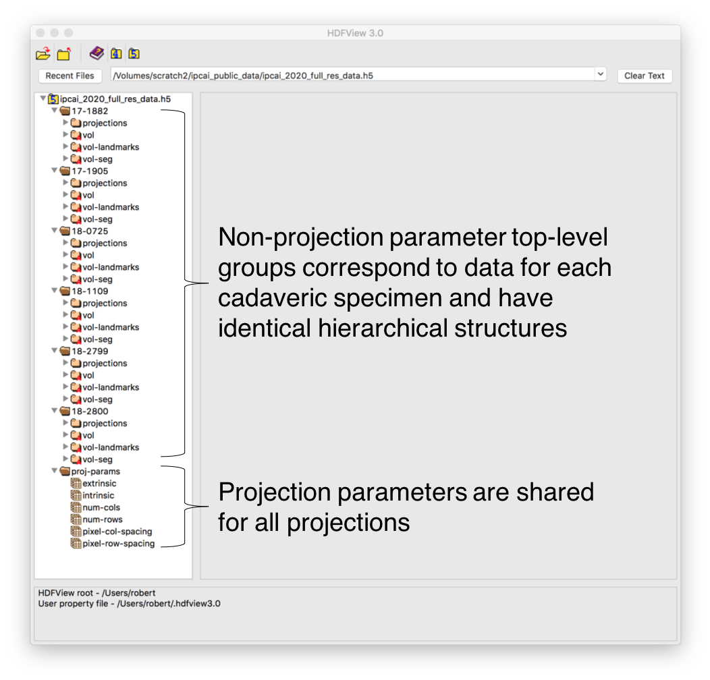
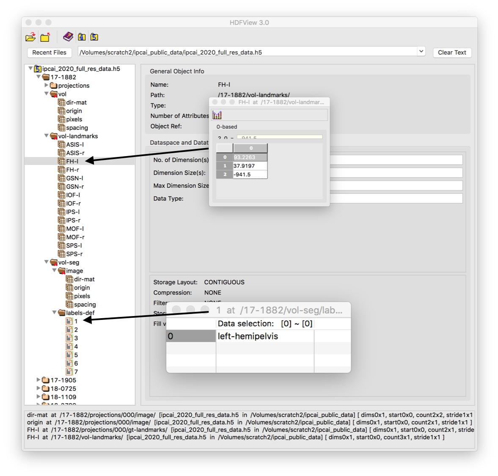
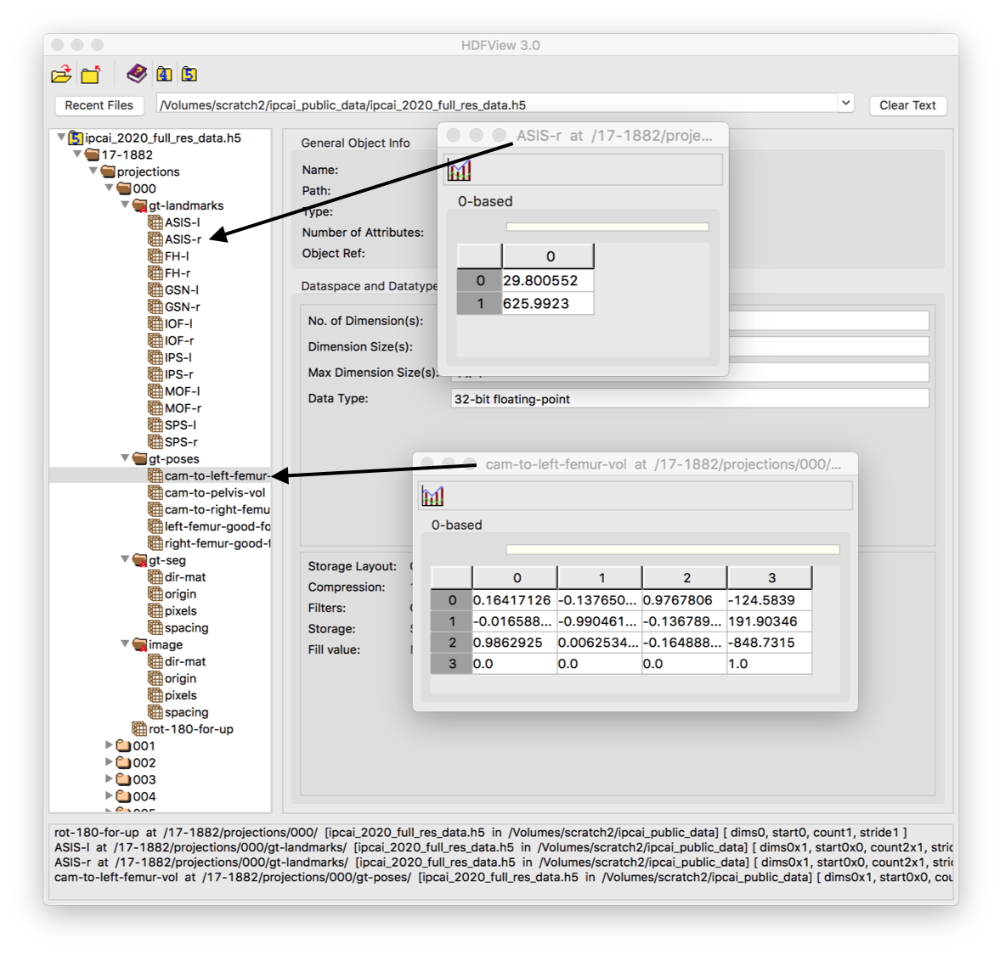

# Data Organization in HDF5 Files

Two types of datasets are provided: a larger full-resolution (in 2D) HDF5 file, and smaller preprocessed HDF5 files.
The preprocessed files are meant to be used directly for training models for segmentation and landmark localization 2D fluoroscopy.
If different preprocessing or 3D information is required, the large full-resolution file may be used.
The full-resolution file contains the following additional information:
- CT volumes (1 mm isotropic spacing),
- Segmentations of the CT volumes,
- Anatomical landmarks annotations in each CT volume,
- Projection intrinsic and extrinsic parameters,
- Ground truth pose information for the pelvis and femurs for each projection.

Some example code for using these files is provided in [examples_dataset](../examples_dataset).
Examples of using the preprocessed datasets for training/testing are in [train_test_code](../train_test_code).

## Full-Resolution File

The hierarchical layout of the full-resolution file with 3D data is described in this section.

Each image/volume group contains information roughly equivalent to that required by an [ITK Image object](https://itk.org/Doxygen/html/classitk_1_1Image.html).
The specific datasets in such groups are:
- `dir-mat` : Rotational alignment of image axes with LPS axes
  - This will be equal to the identity matrix (3x3 or 2x2) for all images in this dataset
- `origin` : Physical point with respect to LPS at the zero image index
- `pixels` : Buffer of pixels, row-major order
- `spacing` : Pixel spacing in mm/pixel
  - `[1,1,1]` for 3D data (x,y,z) (column,row, slice)
  - `[0.194, 0.194]` for 2D data (x,y) (column,row)

Image/volume groups are found in the listing below with the following names/prefixes: `vol`, `vol-seg/image`, `projection number/image`, and `<projection number>/gt-seg`.

Each group at the top-level, except for `proj-params`, stores data for a specific cadaveric specimen.
Projection parameters are stored in `proj-params`.
This is shown visually with the following screenshot from [HDFView](https://www.hdfgroup.org/downloads/hdfview/) of the dataset:

Starting at the top-level, the hierarchical group structure of the file is given by:

- `proj-params` : 2D projection parameters
  - `extrinsic`: Rigid mapping from world frame to camera projective frame
  - `intrinsic` : Projective mapping from camera projective frame onto image plane (3x3 matrix)
  - `num-cols` : Number of columns in each 2D projection (e.g. 1536)
  - `num-rows` : Number of rows in each 2D projection (e.g. 1536)
  - `pixel-col-spacing` : Pixel spacing in column direction (mm / pixel) (e.g. 0.194 mm / pixel)
  - `pixel-row-spacing` : Pixel spacing in row direction (mm / pixel) (e.g. 0.194 mm / pixel)
- Specimen Group, e.g. `17-1882` : Data for a specific specimen
  - `vol` : CT volume group (see above for layout)
  - `vol-seg` : Segmentation of the CT volume
    - `image` : Volume group of the segmentation
    - `labels-def` : Names of each label
      - Integer *N* : Stores the name of label *N*
        - e.g. `1` --> "left-hemipelvis"
  - `vol-landmarks` : 3D Anatomical landmarks in LPS coordinates
    - Landmark name : 3D point of landmark
      - e.g. "FH-l" --> `[93.2, 37.9, -941.5]`
  - `projections`
    - Projection Index : e.g. `005`
      - `image` : Image group for the projection
      - `gt-landmarks` : 2D Anatomical landmarks in pixel coordinates
        - Landmark name : 2D sub-pixel location of landmark
          - **NOTE:** Since landmarks are not always visible in the view, it is the responsibility of the user to check that a landmark lies within the projection bounds.
          - e.g. "MOF-r" --> `[688.3, 1325.4]` (column, row)
      - `gt-poses` :
        - `cam-to-pelvis-vol` : Ground truth pose of the pelvis, maps from the camera world frame to the pelvis volume
        - `cam-to-left-femur-vol` : Ground truth pose of the left femur, maps from the camera world frame to the left femur volume
        - `cam-to-right-femur-vol` : Ground truth pose of the right femur, maps from the camera world frame to the right femur volume
        - `left-femur-good-fov` : Indicator that there is a sufficient view of the left femur that the ground truth pose estimate is valid
          - `0` indicates not valid and `1` indicates valid
        - `right-femur-good-fov` : Indicator that there is a sufficient view of the right femur that the ground truth pose estimate is valid
          - `0` indicates not valid and `1` indicates valid
      - `gt-seg` : Image group for the ground truth segmentation
      - `rot-180-for-up` : Indicator whether the image needs to be rotated by 180 degrees for the patient to be "up"
        - `0` indicates no rotation necessary and `1` indicates rotation necessary

Here is a screenshot using [HDFView](https://www.hdfgroup.org/downloads/hdfview/) to expand the 3D volume groups for specimen `17-1882`:

Here is a screenshot using [HDFView](https://www.hdfgroup.org/downloads/hdfview/) to expand the groups for projection `0` of specimen `17-1882`:

### Notes on Spatial Transforms

All rigid transformations are represented as 4x4 homogeneous matrices.

The projective/camera coordinate frame used in this work is defined as:
- The origin is located at the X-ray source,
- The X-axis is oriented according to increasing columns in the image plane,
- The Y-axis is oriented according to increasing rows in the image plane,
- The Z-axis is orthogonal to the image plane and points towards the X-ray source.

Below is an example of the projective frame, with the X-ray source shown as the eye and the X-ray detector shown as the square image plane:

## Preprocessed File

The preprocessed files store compact representations of the projections, segmentations, and landmarks, which are ready for training and testing of the models.

The following terms will be used when describing the elements of the data file: 
- *N*: The number of projections for a specific specimen; this will change for each specimen
- *C*: The number of columns in each projection
- *R*: The number of rows in each projection
- *L*: The total number of landmarks

The hierarchical structure of each preprocessed file is as follows:

- `land-names` : Group that will contain the names of the landmarks stored in this file
  - `num-lands` : Number of landmarks, equal to *L*
  - `land-XX` : Name of each landmark (there are *L* entries)
    - e.g. `land-00`, `land-01`, ..., `land-13` for 14 landmarks
    - e.g. `land-01` --> `FH-r`
- Specimen Index String : e.g. `01`, `02`, ..., `06`
  - `projs` : *N*x*R*x*C* array of all projections for this specimen
  - `segs` : *N*x*R*x*C* array of all ground truth segmentations for this specimen
  - `lands` : *N*x*2*x*L* array of all landmarks in each projection for this specimen
    - **NOTE:** Since landmarks are not always visible in the view, it is the responsibility of the user to check that a landmark lies within the projection bounds.
    - e.g. `lands[n][0][3]` is the column coordinate of the fourth landmark in the nth projection and `lands[n][1][3]` is the row coordinate.
