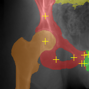
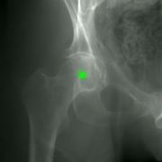
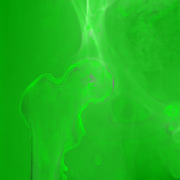

# Training/Testing the Models

The current master branch has been verified to work with pytorch 1.10 as of February 12, 2022. The following pip command should allow these training/testing commands to run successfully (this installs pytorch and h5py):
```
python3 -m pip install torch torchvision torchaudio h5py
```

These commands may also be run in the Google Colab environment, as demonstrated by [this notebook](https://colab.research.google.com/drive/11J791sHYMwgGCyBJIzbqgmgxAAEGz8do?usp=sharing).

## Example Commands

The following commands use the same parameters specified in the companion paper.

Train a network using all images from specimens 2-6 sand leaving out the images from specimen 1:
```
python -u train.py ipcai_2020_ds_8x.h5 --train-pats 2,3,4,5,6 --num-classes 7 --init-lr 0.1 --momentum 0.9 --unet-batch-norm --unet-no-max-pool --unet-img-dim 192 --unet-num-lvls 6 --batch-size 5 --max-num-epochs 500 --unet-init-feats-exp 5 --wgt-decay 0.0001 --data-aug --unet-padding --nesterov --checkpoint-net yy_check_net.pt --checkpoint-freq 100 --use-lands --best-net yy_best_net.pt --lr-sched plateau --train-valid-split 0.85 --train-loss-txt yy_train_loss.txt --valid-loss-txt yy_valid_loss.txt --heat-coeff 0.5
```
Also note that there are 7 classes, the six bone structures and background.
Pass the `--help` flag for additional usage options.

Test the network and compute segmentations and landmark heatmaps for all images of left-out specimen 1:
```
python -u test_ensemble.py ipcai_2020_ds_8x.h5 spec_1_test.h5 --pats 1 --nets yy_best_net.pt
```

Estimate landmark point locations from the estimated heatmaps and segmentations and store in a CSV file:
```
python est_lands_csv.py spec_1_test.h5 nn-heats --use-seg nn-segs --pat 1 --out spec_1_lands.csv
```

Compute overlay images of the estimated annotations:
```
python overlay_est_ann.py ipcai_2020_ds_8x.h5 spec_1_test.h5 nn-segs 1 3 spec_1_est_ann_proj_3.png --lands --no-gt-lands --lands-csv spec_1_lands.csv
```

This should produce an image similar to:



Compare the estimated segmentations to ground truth using dice coefficients, writing the output to a CSV file:
```
python compute_actual_dice_on_test.py ipcai_2020_ds_8x.h5 spec_1_test.h5 nn-segs spec_1_dice.csv 1
```

Create an overlay of the estimated heatmap for the right femoral head in projection 3:
```
python overlay_est_heat.py ipcai_2020_ds_8x.h5 spec_1_test.h5 nn-heats 1 3 1 spec_1_proj_3_fhr_est_heat.png
```

You could get something similar to:



An estimated heatmap overlay for left femoral head in the same projection:
```
python overlay_est_heat.py ipcai_2020_ds_8x.h5 spec_1_test.h5 nn-heats 1 3 0 spec_1_proj_3_fhl_est_heat.png
```

Notice how the network assigns more of a uniform distribution, since the landmark is not visible (min/max normalized for display):



## Previous Environment Used in IPCAI Paper
CUDA 9.2, the Anaconda Python 3.7 distribution, and PyTorch 1.2 were used for the experiments conducted in the IPCAI 2020 companion paper.
PyTorch was installed with the following command:
```
conda install pytorch torchvision cudatoolkit=9.0 -c pytorch
````
